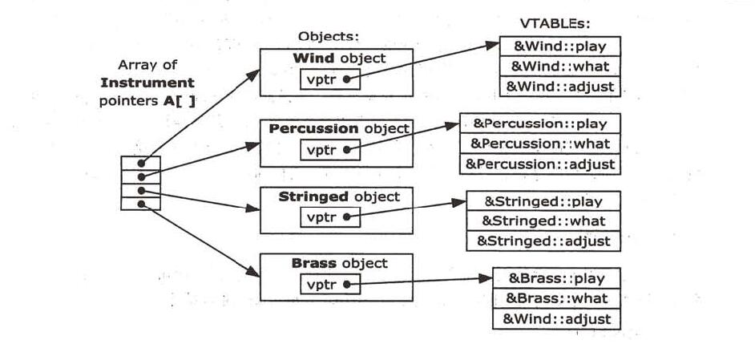

 # 第3章 C++中的C

## 3.11 make：管理分段编译

### 3.11.1 make的行为

	在makefile中，所有注释都是以“#”开头，到行尾。

eg.  一个名为"hello"的程序的makefile可能包含：
	
	# A commment
	hello.exe: hello.cpp  (hello.exe依赖于hello.cpp)
		mycompiler hello.cpp  (所有规则以tab开头)

#### 3.11.1.1 宏

	eg： 
	CPP = mycompiler
	hello.exe: hello.cpp
		$(CPP) hello.cpp

#### 3.11.1.2 后缀规则

	CPP = mycompiler
	.SUFFIXS: .exe .cpp
	.cpp.exe:
		$(CPP) $<

#### 3.11.1.3 默认目标

 
 
 

# 第4章  数据抽象

	C++是为了提高C的生产效率，而大幅度提高生产效率的唯一办法是使用别人的代码，即区使用库。
	C++的主要设计目标之一就是使库使用起来更加容易。

## 4.1 一个袖珍的C库

### 4.1.1 动态存储分配

## 4.2 哪儿出问题

    C只有一个“命名空间”， 名字冲突！

## 4.3 基本对象

：： -----作用域解析运算符

this

## 4.4 什么是对象

基于对象 &   面向对象

## 4.5 抽象数据类型

	调用成员函数   &   向对象发消息
	
	面向对象： 创建一组对象并向它们发消息。

## 4.6 对象细节

	“对象应对多大和它应当像什么？”
	“和C的struct一样。”

## 4.7 头文件形式

	头文件是存放接口规范的地方。

### 4.7.1 头文件的重要性

C++通过强制正确的使用头文件，语言保证库中的一致性，并通过在各处强制使用相同的接口， 可以减少程序错误。

“应当放什么到头文件中？”        基本的原则是“只限于声明”，即只限于对编译器的信息， 不涉及通过生成代码或创建变量而分配存储的人人信息。

### 4.7.2 多次声明问题

	头文件保护...

### 4.7.3 预处理器指示#define、 #ifdef和#endif

	#define FLAG
	#ifdef FLAG
	#endif //FLAG
	在同一行中，#endif之后无注释是不合规定的，尽管一些编译器可以接受这样的行。
	#undef
	#ifndef

### 4.7.4 头文件的标准

	#define SIMPLE_H
	#ifdef SIMPLE_H
	#endif //SIMPLE_H	   【对文档有用】

### 4.7.5 头文件中的名字空间
	
不要在头文件中放置using使用指令。

### 4.7.6 在项目中使用头文件

	当使用C++建立项目时， 我们通常要汇集大量不同的类型（带有相关函数的数据结构）。      一般将每个类型或一组相关类型的声明放在一个单独的头文件中， 然后在一个处理单元中定义这个类型的函数。当使用这个类型时必须包含这个头文件 ，执行正确的声明。

## 4.8 嵌套结构

### 4.8.1 全局作用域解析

	//Scoperes.cpp   Global scope resolution
	int a;

	void f(){}
	
	struct S{
		int a;
		void f();
	};

	void S::f(){
		::f();   // 全局的函数,没有::就会递归调用！
		::a ++； //全局变量a
		a --;   //struct S内的a
	}	
 
 
 
# 第5章  隐藏实现

## 5.1 设置限制

* 一是让客户程序员远离他们不需要使用的工具。
* 二手允许库的设计者改变内部实现，不对客户程序员产生影响。
	
## 5.2 C++的访问控制

**访问说明符：**

* public
* private
* protected

## 5.3 友元

	不完全的类型说明（incomplete type specification）

### 5.3.1 嵌套友元

  嵌套的结构并不能自动获得访问private成员的权限。要获得访问私有成员的权限，必须遵守特定的规则： 首先声明（而不定义）一个嵌套的结构， 然后声明它是全局范围使用的一个friend，最后定义这个结构。    结构的定义必须与friend声明分开，否则编译器将不把他看做成员。

	
	eg:
	// NestFriend.cpp
	#include <iostream>
	#include <cstring>  //memset()    Page 137
	using namespace std;
	const int sz = 20;

	struct Holder{
	private:
		int a[sz];
	public:
		void initialize();
		struct Pointer;
		friend Pointer;
		struct Pointer{
			...
		};
	};	

### 5.3.2 它是纯面向对象的吗
	
	C++不是完全的面向对象语言， 而只是一个混合产品。 增加friend关键字就是为了用来解决一些实际问题。  【这也说明这种语言是不纯的。毕竟C++语言的设计目的是实用，而不是追求理想的抽象。】

## 5.4 对象布局

	访问说明符是结构的一部分，它们并不影响从这个结构创建的对象。程序开始运行之前，所有的访问说明信息都消失了。访问说明信息通常是在编译期间消失的。 在程序运行期间，对象变成了一个存储区域，别无他物，因此，如果有人真的想破坏这些规则并且直接访问内存中的数据，就如在C中所做的那样，那么C++并不能防止他做这种不明智的事，它只是提供人们一个更容易、更方便的方法。

## 5.5 类
	
	在C++中，class是一个非必要的关键字，不过考虑到struct的向后兼容性，得添加class。

### 5.5.1 用访问控制来修改Stash

### 5.5.2 用访问控制来修改Stack		

	访问控制的真正价值体现在开发阶段中的防止越界。

## 5.6 句柄类  

	C++中的访问控制允许将实现部分和接口部分分开，但实现部分的隐藏是不完全的。编译器仍然必须知道一个对象的所有部分的声明， 以便正确地创建和管理它。 【C++要尽可能多地在编译期间作静态检查，这意味着尽早捕获错误，程序具有更高的效率】

	不好影响： 
	1. 客户程序员虽不能轻易访问私有实现部分，但可以看到它。
	2. 造成一些不必要的重复编译。

### 5.6.1 隐藏实现

	源程序上不太好隐藏，就把一个编译好的实际结构放在实现文件中，而不是让其暴露在头文件中。

### 5.6.2 减少重复编译

**易碎的基类问题（fragile base-class problem）**  

对于一个大的项目而言， 在开发初期这可能非常难以处理，因为内部实现部分可能需要经常改动。如果这个项目非常大，用于编译的时间过多可能妨碍项目的快速转型。

解决这个问题的技术有时称为**句柄类（handle class）**或“Cheshire cat”。  有关实现的任何东西都消失了， 只剩下一个单指针“smile”。该指针指向一个结构，该结构的定义与其所有的成员函数的定义一同出现在**实现文件**中。 这样，只要接口部分不改变，头文件就不需要变动。而实现部分可以按需任意更改，完成后只需对实现文件进行重新编译，然后重新链接到项目中。

	eg:
	// Handle.h
	// Handle classes
	
	#ifndef HANDLE_H
	#define HANDLE_H
	
	class Handle{
	public:
		void initialize();
		void cleanup();
		int read();
		void change(int);
	private:
		struct Cheshire; // 头文件仅仅声明（不完全的类型说明），其具体实现的结构体隐藏在实现文件中。
		Cheshire *smile;
	};

	#endif // HANDLE_H

	// 以上是所有客户程序员都能看到的。

	// Handle.cpp
	// Handle implementation

	#include "Handle.h"
	#include "../require.h"

	//定义Handle的实现
	struct Handle::Cheshire{
		int i;
	};

	void Handle::initialize(){
		smile = new Cheshire;
		smile->i = 0;
	}

	void Handle::cleanup(){
		delete smile;
	}

	int Handle::read(){
		return smile->i;
	}

	void Handle::change(int x){
		smile->i = x;
	}

 在Handle::initialize()中，为Cheshire结构分配存储空间，在Handle::cleanup()中，释放这些存储空间。这些内存被用来**代替**类的所有**private部分**。【实现了隐藏】
 当编译Handle.cpp时， 这个结构的定义被隐藏在目标文件中，没有人能看到它。如果改变了Cheshire的组成，唯一要重新编译的是Handle.cpp，因为头文件没有改动。【减少了重复编译】

## 5.7 小结

  在C++中，访问控制为类的创建者提供了很有价值的控制。类的客户程序员可以清楚的看到，什么可以用，什么应该忽略。 更重要的是，它保证了类的客户程序员不会依赖类的任何细节。 有了这些，我们就可以**更改类的实现部分**，没有客户程序员会因此受到影响，因为他们并不能访问类的这一部分。

  一旦拥有了更改实现部分的自由，就可以在以后的时间里更改我们的设计，而且**允许犯错误**。 要知道，无论如何小心的计划和设计，都可能犯错误。犯些错误也是相对安全的，这意味着我们会变得更有经验，会学得更快，就会更早完成项目。

  一个类的公共接口部分是客户程序员能看到的。所以在分析设计阶段，保证接口的正确性更加重要。 但这并不是说接口不能做修改。 如果第一次没有正确地设计接口部分，可以再增加函数，这样就不需要删除那些已使用该类的程序代码。

 
 
 

# 第6章 初始化与清除

	在C++中，初始化和清除的概念是简化酷的使用的关键所在，并可以减少那些在客户程序员忘记去完成这些操作是会引起的细微错误。

## 6.1 用构造函数确保初始化

在程序中创建和清除一个对象的行为非常特殊，就像出生和死亡，而且总是由编译器来调用构造析构函数以确保它们被执行，无返回值。

## 6.2 用析构函数确保清除

## 6.3 清除定义块

	在尽可能靠近变量的使用点处定义变量。

### 6.3.1 for循环

小作用域是良好设计的指标。 若一个函数有好几页，也许正在试图让这个函数完成**太多**的工作。 如果用更多细化的函数，不仅更有用，而且更容易发现错误。

### 6.3.2 内存分配

## 6.4 带有构造函数和析构函数的Stash

## 6.5 带有构造函数和析构函数的Stack

## 6.6 集合初始化

数组有一种叫自动计数（automatic counting）的快速初始化方法

	int c[] = {1, 2, 3, 4};
 
如果决定增加另一个元素到这个数组，只要增加一个初始化值即可，如果以此建立我们的代码，只需在一处作出修改即可，数组大小用表达式
	
	sizeof c / sizeof *c

算出，当数组大小改变时它不需要修改。

	只要有构造函数，无论是所有成员都是公共的struct还是一个带私有成员的class,所有的初始化工作都必须通过构造函数来完成，即使正在对一个集合初始化。

## 6.7 默认构造函数

	尽管编译器会创建一个默认的构造函数，但是编译器合成的构造函数的行为很少是我们期望的。 我们应该把这个特征看成是一个安全网，单尽量少用它。 

**一般说来，应该明确的定义自己的构造函数，而不让编译器来完成。**

 
 
 

# 第7章  函数重载与默认参数

	本章的主题就是方便地使用函数名。

## 7.1 名字修饰（name decoration）

	void print(char);
	void print(float);

### 7.1.1 用返回值重载

由于在C中，总是可以调用一个函数但忽略它的返回值。

	仅仅靠返回值来重载函数实在过于微妙了，所有在C++中

**禁止这样做！**

### 7.1.2 类型安全连接

在C++中，所有的函数在被使用前都必须事先声明。 编译器不会自动添加函数声明，所以我们应该包含一个合适的头文件。 

	名字修饰会给我们提供一个安全网，这也就是人们常说的类型安全连接（type-safe linkage)。

## 7.2 重载的例子

构造函数重载。

## 7.3 联合（union）

一个union也可以带有构造函数、析构函数、成员函数甚至访问控制。

	union不能再继承是作为基类使用。

	// SuperVar.cpp    A super-variable
	#include <iostream>
	using namespace std;

	class Supervar{
		enum{
			character,
			integer,
			floating_point
		} vartype;   //无类型名， 没必要。 枚举的类型名是可选的，不是必须的。
		union{      // 匿名联合（anonymous union)
 			char c;
			int i;
			float f;
		};
	public:
		SuperVar(char ch);
		SuperVar(int ii);
		superVar(float ff);
		void print();
	};

	SuperVar::SuperVar(char ch){
		vartype = character;
		c = ch;
	}

	SuperVar::SuperVar(int ii){
		vartype = integer;
		i = ii;
	}

	SuperVar::SuperVar(float ff){
		vartype = floating_point;
		f = ff;
	}

	void SuperVar::print(){
		switch(vartype){
			case character:
				cout << "character: " << c < endl;
				break;
			case integer:
				cout << "integer: " << i << endl;
				break;
			case floating_point:
				cout << "float: " << f << endl;
				break;
		}
	}

	int 
	main(){
		SuperVar A('c'), B(12), C(1.44f);
		A.print();	
		B.print();
		C.print();
		return 0;
	}

## 7.4 默认参数

默认参数只能放在函数声明中，通常在一个头文件中。   有时人们为了阅读方便，在函数定义处放上一些默认的注释值。

	eg: void fn(int x /* = 0 */){ //...

### 7.4.1 占位符参数

## 7.5 选择重载还是默认参数

	设计类是，最重要的问题是类的接口（客户程序员可以使用的public成员）。如果产生的类容易使用和重用，那说明成功了。 若有必要，总是可以为了效率而做适当的调整。但是，如果程序员过分强调效率的话，设计的类的效果将是可怕的。

应该注意关心的是**接口清晰**,是使用和阅读代码的人易于理解。

## 7.6 小结

	不能把默认参数作为一个标准去决定执行函数的哪一块，只是基本原则。

在这种情况下，只要能够，就应该把函数分解成两个或多个重载的函数。一个默认的参数应该是一个在一般情况下放在这个位置的值。这个值出现的可能比其他值要大，所有客户程序员可以忽略它或在需要改变默认值时才去用它。

	默认参数的一个重要应用情况是在开始定义函数是用了一组参数，而使用了一段时间后发现要增加一些参数。通过把这些新增参数都作为默认的参数，就可以保证所有使用这一函数的客户代码不会受到影响。

 
 
 

# 第8章   常量

	常量概念（由关键字const表示）是为了使程序员能够在变和不变之间画一条界线。 这在C++程序设计项目中提供了安全性和可控性。

## 8.1 值替代

C语言预处理器（#define）仅仅做**值替代**，会产生一些微小的问题，【没有类型信息，会隐藏一些很难发现的错误】在C++中可以通过使用const值而避免。

### 8.1.1 头文件里的const

### 8.1.2 const的安全性

	const的作用不仅限于在常数表达式里代替#defines。 如果用运行期间产生的值初始化一个变量而且知道在变量生命期内是不变的，则用const限定该变量是程序设计中的一个很好的做法。

### 8.1.3 集合【数组、结构体...】

	不能再编译期间使用集合的值。

### 8.1.4 与C语言的区别

	C总是迫使程序员在预处理器里使用#define。

## 8.2 指针

	const指针： 一是常量折叠，很少使用。  二，更重要的是，如果程序员以后想在程序代码中改变const这种指针的使用，编译器将给出通知，这大大增加了安全性。

### 8.2.1 指向const的指针

	const int *u;   等价于  int const *u;
	应该尽量用第一种形式，读为“u是一个指针，它指向一个const int”。

### 8.2.2 const指针

	int d = 1;
	int *const w = &d;

现在它读成“w是一个指针，这个指针是指向int的const 指针”。

	int d = 1;
	const int *const x = &d;
	int const　＊const x2 = &d;

现在，指针和对象都不能改变。

### 8.2.3 赋值和类型检查

#### 8.2.3.1 字符数组的字面值

限定词const是很严格的，**没有强调**const的地方是字符数组的字面值。

## 8.3 函数参数和返回值

### 8.3.1 传递const值 //？？？

	如果函数参数是按值传递，则可用制定参数是const的。 ...?

### 8.3.2 返回const值

对于内部类型来说，按值返回的是否是一个const，是无关紧要的，所有按值返回一个内部类型时， 应该去掉const，从而不使客户程序员混淆。

当处理**用户定义**的类型时， 按值返回常量是**很重要**的。  如果一个函数按值返回一个类对象为const时，那么这个函数的返回值不能是一个左值（即它不能被赋值，也不能被修改）。 

	eg:
	// ConstRetrunValue.cpp
	
	class X{
		int i;
	public:
		X(int ii = 0);
		void modify();
	};
	
	X::X(int ii){i = ii;}

	void X::modify(){++ i;}

	X f5(){
		return X();
	}

	const X f6(){
		return X();
	}

	void f7(X &x){  // 非const引用
		x.modify();
	}

	int
	main(){
		f5() = X(1);
		f5().modify();
	//!Waring		f7(f5())；   // 引起警告，会产生一个临时量？？
	// Causes compile-time errors:
	//!  f6() = X(1);		
	//!	 f6().modify();
	//!  f7（f6()）；
		
		return 0;
	}

#### 8.3.2.1 临时量

在上面的例子中，表达式：

	f7(f5());

中，编译器必须产生一个临时对象【该对象为const!】来保存f5()的返回值，使得它能传递给f7()。

下面的表达式是合法的：

	f5() = X(1);
	f5().modify();

尽管它们可以编译通过，但实际上**存在问题。**    f5()返回一个X对象，而且对编译器来说，要满足上面的表达式，它必须创建临时对象来保存返回值。于是，在这两个表达式中，临时对象也被修改，表达式被编译过之后，临时对象**也将被清除**，结果，丢失了所有的修改！

### 8.3.3 传递和返回地址

	无论什么时候传递一个地址给一个函数，都应该尽可能用const修饰它。如果不这样做，就不能以const指针参数的方式使用这个函数。

#### 8.3.3.1 标准参数传递

	当传递一个参数是，首先选择按引用传递，而且是const引用。

**Important Example**

	// ConstTemporary.cpp   Temporaries are const

	class X{};
	
	X f(){return X();}  //按值返回

	void g1(X &){}  // 传非常引用（Pass by non-const reference）
	void g2(const X &){} // 传常引用

	int
	main(){
		// Error: const temporary created by f():
	//! g1(f());
		// OK: g2 takes a const reference:
		g2(f());

		return 0;
	}

## 8.4 类

	为了保证一个类对象为常量，引进了const成员函数：const成员函数只能对于const对象调用。

### 8.4.1 类里的const

#### 8.4.1.1 构造函数初始化列表

该表里的初始化发生在构造函数的任何代码执行之前。这是初始化所有const的地方，所以类里的**const**的正确形式是：

	// ConstInitialization.cpp  Initailizing const in classes
	
	#include <iostream>
	using namespace std;

	class Fred{
		const int size;
	public:
		Fred(int sz);
		void print();
	};

	Fred::Fred(int sz):size(sz){}
	void Fred::print(){cout << size << endl;}

	int
	main(){
		Fred a(1), b(2), c(3);
		a.print();
		b.print();
		c.print();
	
		return 0;
	}

#### 8.4.1.2 内部类型的“构造函数”

	int i(20);

内部类型像自定义类！

### 8.4.2 编译期间类里的常量

	类里面使用 static const.

#### 8.4.2.1 旧代码中的“enum hack”

	class Bunch{
		enum {size = 1000};
		int i[size];
	};
	

### 8.4.3 const对象和const成员函数

	不修改数据成员的任何函数都应该把它们声明为const,这样他可以和const对象一起使用。

#### 8.4.3.1 可变的： 按位(bitwise)const和按逻辑(logical)const

强制转换常量性（casting away constness）

	eg:
	// Castaway.cpp   "Casting away" constness

	class Y{
		int i;
	public:
		Y();
		void f() const;
	};

	Y::Y(){i = 0;}

	void Y::f() const{
	//! ++ i; //Error -- const member function
		((Y*)this)->i ++; // OK: cast away constness
	// Better: use C++ explicit cast syntax:
		(const_cast<Y*>(this))->i ++；
	}

	int
	main(){
		const Y yy;
		yy.f(); // Actually changes it!		
	
		return 0;
	}

这种方法是可行的，在过去的程序代码里可以看到这种用法，但不是首选。

cause常量性的缺乏隐藏在成员函数的定义中。应当在类声明里使用关键字mutable，以指定一个特殊的数据成员可以在一个const对象里被改变。

	// Mutable.cpp   The "mutable" keyword

	class Z{
		int i;
		mutable int j;
	public:
		Z();
		void f() const;
	};

	Z::Z():i(0), j(0){}

	void Z::f() const {
	//! ++ i; //Error -- const member function
		++ j; //OK: mutable
	}

	int
	main(){
		const Z zz;
		zz.f(); // Actually changes it!

		return 0;
	}

#### 8.4.3.2 只读存储能力

	目前还没有什么对象需要放进ROM里。

## 8.5 volatile

volatile的语法与const一样，但是volatile的意思是“在编译器认识的范围外，这个数据可以被改变”。不知何故，环境正在改变数据（可能通过多任务、多线程或者中断处理）， 所以，volatile告诉编译器不要擅自多出有关该数据的任何假定，优化期间尤其如此。

	就像建立const对象一样，程序员也可以建立volatile对象，甚至可以建立const volatile对象，这个对象不能被客户程序员改变，但可通过外部的代理程序改变。

## 8.6 小结

	尽管可以忽视const而继续使用旧的C代码习惯，但是他确实有帮助，第11章将改变他们的做法，在第11章将开始大量使用引用，那时将看到对函数参数使用const时多么关键。

类的const成员**必须**在构造函数的**初始化列表**里初始化！ 不可以在构造函数内初始化。

 
 
 

# 第9章 内联函数

在C++中，使用预处理器（提高效率）存在两个问题。第一个问题在C中也存在：宏看起来像一个函数调用，但并不总是这样。这样就隐藏了难以发现的错误。     第二个问题是C++特有的：预处理器不允许访问类的成员数据。这意味着预处理器宏不能用作类的成员函数。

	为了既保持预处理器宏的效率又增加安全性，而且还能像一般成员函数一样可以在类里访问自如，C++引入了**内联函数**（inline function)。

## 9.1 预处理器的缺陷

### 9.1.1 宏和访问

## 9.2 内联函数

在C++中，宏的概念是作为内联函数来实现的，而内联函数无论从哪一方面说都是真正的函数。

	应该（几乎）永远不使用宏，只使用内联函数。

**任何在类中定义的函数自动地成为内联函数**，但也可以在非类的函数前加上inline关键字使之成为内联函数。      为使之有效，必须使函数体和声明结合在一起，否则，编译器将它作为普通函数对待。

 

在头文件中，内联函数处于一种**特殊状态**，因为在头文件声明该函数，所以必须包含头文件和该函数的定义，这些定义在每个用到该函数的文件中，但是不会出现产生多个定义错误的情况（不过，在任何使用内联函数的地方该内联函数的定义都必须是相同的）。

### 9.2.1 类内部的内联函数

### 9.2.2 访问函数

	在类中内联函数的最重要的使用之一是用作访问函数（access function）。

#### 9.2.2.1 访问器和修改器

一些人进一步把访问函数的概率分成访问器（accessor）（用于从一个对象读状态信息）和修改器（mutator）（用于修改状态信息）。 而且，可以用重载函数为访问器和修改器提供相同函数名，如何调用函数来决定是读还是修改状态信息。

	//Rectangle.cpp  Accessors & mutators

	class Rectangle{
		int wide, high;
	public:
		Rectangle(int w = 0, int h = 0):wide(w), high(h){}
		int width() const{return wide;} //Read
		void width(int w){wide = w;}     //Set
		int height() const{return high;} //Read
		void height(int h){high = h;}     //Set
	};

	int
	main(){
		Rectangle r(19, 47);
		//Change width & height:
		r.height(2 * r.width());
		r.width(2 * r.height());

		return 0;
	}

函数名不应该和变量同名，可加set\get。 

	getWidth     setWidth

 当然，访问器和修改器对于内部变量来说，不必是简单的管道。有时，它们可以执行一些比较复杂的计算。 下面的例子使用标准C库函数中的时间函数来生成简单的Time类：

	//Cpptime.h   A simple time class
	#ifndef CPPTIME_H
	#define CPPTIME_H
	#include <ctime>
	#include <cstring>

	class Time{
		std::time_t t;
		std::tm local;
		char asciiRep[26];
		unsigned char lflag, aflag;
		void updateLocal(){
			if(!lflag){
				local = *std::localtime(&t);
				++ lflag;
			}
		}
		void updateAscii(){
			if(!aflag){
				updateLocal();
				std::strcpy(asciiRep,  asctime(&local));
				++ aflag;
			}
		}
	public:
		Time(){mark();}
		void mark(){
			lflag = aflag = 0;
			time(&t);
		}
		const char *ascii(){
			updateAscii();
			return asciiRep;
		}
		// Difference in seconds:
		int delta(Time *dt) const{
			return int(difftime(t, dt->t));
		}
		int daylightSavings(){
			updateLocal();
			return local.tm_isdst;
		}
		int dayOfYear(){  // Since January 1
			updateLocal();
			return local.tm_yday;
		}
		int dayOfWeek(){  // Since Sunday
			updateLocal();
			return local.tm_wday;
		}
		int since1900(){  // Years since 1900
			updateLocal();
			return local.tm_year;
		}
		int month(){  // Since January
			updateLocal();
			return local.tm_mon;
		}
		int dayOfMonth(){ 
			updateLocal();
			return local.tm_mday;
		}
		int hour(){  // Since midnight, 24-hour clock
			updateLocal();
			return local.tm_hour;
		}
		int minute(){  
			updateLocal();
			return local.tm_min;
		}
		int second(){ 
			updateLocal();
			return local.tm_sec;
		}
	};

	#endif //CPPTIME_H	

下面是一个小的测试程序：

	// Cpptime.cpp  Testing a simple time class
	#include <iostream>
	#include "Cpptime.h"
	using namespace std;
	int
	main(){
		Time start;
		for(int i = 1; i < 1000; ++ i){
			cout << i << ' ';
			if(i % 10 == 0)
				cout << endl;
		}
		Time end;
		cout << endl;
		cout << "start = " << start.ascii();
		cout << "end = " <<　end.ascii();
		cout << "delta = " << end.delta(&start);
	
		return 0;
	}

## 9.3 带内联函数的Stash和Stack

## 9.4 内联函数和编译器

相对于宏， 多了类型检查，支持类的成员函数成为内联函数。

### 9.4.1 限制

	假如函数太复杂，编译器将不能执行内联。 一般地，任何种类的循环都被认为太复杂而不扩展为内联函数。     
	内联仅是编译器的一个建议！

### 9.4.2 向前引用

	// EvaluationOrder.cpp  Inline evaluation order

	class Forward{
		int i;
	public:
		Forward():i(0){}
		// Call to undeclared function:
		int f() const{return g() + 1;}
		int g() const{return i;}
	};                           
	
	int 
	main(){
		Forward frwd;
		frwd.f();

		return 0;
	}

函数f()调用g()，但此时还没有声明g()。这**也能**正常工作，因为C++语言规定：只有在类声明结束后，其中的内联函数才会被计算。

### 9.4.3 在构造函数和析构函数里隐藏行为

	一般来说，快速的写代码来建立一个程序的初始“轮廓”时，使用内联函数经常是便利的。但假如要考虑效率，内联是值得注意的一个问题。

## 9.5 减少混乱

可以考虑统一内联函数的格式：加inline放在类外实现。

## 9.6 预处理器的更多特征

	几乎总是希望使用内联函数代替预处理器宏，有3个特殊特征例外：字符串定义、字符串拼接和标准粘贴。

字符串定义的完成是用#指示，它容许取一根标识符并把它转化为字符数组，然而字符串拼接在两个相邻的字符串没有分隔符是发生，在这种情况下字符串组合在一起。 在写调试代码是，这两个特征特别有用。

	#define DEBUG(x) cout << #x" = " << x << endl

	#define TRACE(s) cerr << #s << endl, s  //s代表sentence

### 9.6.1 标准粘贴

标志粘贴直接用“##”实现，在写代码是非常有用。它允许设两个标识符并把它们粘贴在一起自动产生一个新的标识符。例如：

	#define FIELD(a) char *a##_string; int a##_size
	class Record{
		FIELD(one);
		FIELD(two);
		FIELD(three);
		// ...
	};
	

## 9.7 改进的错误检查

	// require.h
	// Test for error conditions in programs
	// 	Local "using namespace std" for old compilers

	#ifndef REQUIRE_H
	#define REQUIRE_H
	#include <cstdio>
	#include <cstdlib>
	#include <fstream>
	#include <string>

	inline void require(bool requirement,
		const std::string &msg = "Requirement failed"){
		using namespace std;
		if(!requirement){
			fputs(msg.c_str(), stderr);
			fputs("\n", stderr);
			exit(1);
		}
	}

	inline void requireArgs(int argc, int args,
		const std::string &msg = 
			"Must use %d arguments"){
		using namespace std;
		if(argc != args + 1){
			fprintf(stderr, msg.c_str(), args);
			fputs("\n", stderr);
			exit(1);
		}
	}	

	inline void requireMinArgs(int argc, int minArgs,
		const std::string &msg = 
			"Must use at least %d argument"){
		using namespace std;
		if(argc < minArgs + 1){
			fprintf(stderr, msg.c_str(), minArgs);
			fputs("\n", stderr);
			exit(1);
		}
	}

	inline void assure(std::ifstream &in,
		const std::string &filename = ""){
		using namespace std;
		if(!in){
			fprintf(stderr, "Could not open file %s\n",
				filename.c_str() );
			exit(1);
		}
	}

	inline void assure(std::ofstream &out,
		const std::string &filename = ""){
		using namespace std;
		if(!out){
			fprintf(stderr, "Could not open file %s\n", 
				filename.c_str() );
			exit(1);
		}
	}

	#endif //REQUIRE_H

 
 
 

# 第10章 名字控制   //some difficult

## 10.1 来自C语言中的静态元素

**static**的两种基本含义：

1. 在固定的地址上进行存储分配
2. 对一个特定的编译单元来说是局部的(这在C++中局限于类的范围）。

### 10.1.1 函数内部的静态变量

	函数内部static变量，只在第一次调用是初始化一次。

#### 10.1.1.1 函数内部的静态对象

#### 10.1.1.2 静态对象的析构函数

	在C++中，全局静态对象的析构函数是在main()之前调用的，所以现在有了一个进入main()之前执行一段代码的简单的、可移植的方法，并且可以在退出main()之后用析构函数执行代码。

### 10.1.2 控制连接

	外部连接(external linkage)
	内部连接(internal linkage)

#### 10.1.2.1 冲突问题

### 10.1.3 其他存储类型说明符

	static和extern用得很普遍，还有auto和register【很少用！】。

## 10.2 名字空间

	namespace唯一的目的是产生一个新的名字空间。

### 10.2.1 创建一个名字空间

创建一个名字空间与创建一个类非常相似：

	// MyLib.cpp
	namespace MyLib{
		// Declarations	
	}
	int
	main() {}

这就产生了一个新的名字空间，其中包含了各种声明。然而，namespace与class、struct、union和enum有着明显的区别：

* namespace只能在全局范围内定义，但它们之间可以互相嵌套。
* 在namespace定义的结尾，右花括号的后面不必跟一个分号。
* 一个namespace可以在多个头文件中用一个标识符来定义，就好像重复定义一个类一样。

	// Header1.h
	#ifndef HEADER1_H
	#define HEADER1_H
	namespace MyLib{
		extern int x;
		void f();
		// ...
	}

	#endif //HEADER1_H

	// Header2.h
	#ifndef HEADER2_H
	#define HEADER2_H
	#include "Header1.h"
	// Add more names to MyLib
	namespace MyLib{ // 不是重定义！
		extern int y;
		void g();
		// ...
	}

	#endif //HEADER2_H

* 一个namespace的名字可以用另一个名字来作为它的别名，这样就不必敲打那些开发商提供的冗长的名字了。、

#### 10.2.1.1 未命名的名字空间

每一个编译单元都可包含**一个**未命名的名字空间——可以不用标识符而只用“namespace”增加一个名字空间。

#### 10.2.1.2 友元

可以在一个名字空间的类定义之内插入(inject)一个友元（friend）声明：

	// FriendInjection.cpp
	namespace Me{
		class Us{
			// ...
			friend void you();
		};
	}
	int 
	main(){}

这样函数you()就成了名字空间Me的一个成员。

### 10.2.2 使用名字空间

1. 用作用域运算符
2. 用using指令把所有名字引入名字空间中
3. 用using声明一次性引用名字

#### 10.2.2.1 作用域解析

名字空间中的任何名字都可以用作用域运算符作明确的指定，就像引用一个类中的名字一样

#### 10.2.2.2 使用指令

	using关键字
	使用指令(using directive)

	注意二义性和名字冲突

#### 10.2.2.3 使用声明（using declaration）

	using namespace U;  // using directive
	using V::f；        // using declaration

一个using声明是一个别名，它允许在不同的名字空间声明同样的函数。如果不想由于引入不同名字空间而导致重复定义一个函数是，可以使用using声明，**它不会引起任何二义性和重复。**

### 10.2.3 名字空间的使用

	在头文件中，最好使用明确的限定或者想定在一定范围内的using指令和using声明。

## 10.3 C++中的静态成员  \\ difficult

有时需要为某个类的所有对象分配一个单一的存储空间。（便于数据传递...）在C语言中，可以用全局变量，但不安全。 C++ 中可以用类的静态数据成员来实现。

类的静态数据成员拥有一块单独的存储区，而不管创建了多少个该类的对象。所有的这些对象的静态数据成员都共享这一块静态存储空间，这就为这些对象提供了一种互相通信的方法。

静态数据属于类，它的名字只在类的范围内有效，而且可以是public、private、protected。

### 10.3.1 定义静态数据成员的存储

因为类的静态数据成员有着单一的存储空间而不管产生了多少个对象，所以存储空间必须在一个单独的地方定义。定义必须出现在类的外部（不允许内联）而且只能定义一次，因此它通常放在一个类的实现文件中。

如果一个静态数据成员被声明但没有定义时，链接器会报告一个错误。

	// eg
	class A{
		static int i;
	public：
		// ...
	};

之后，必须在定义文件中为静态数据成员定义存储区：

	int A::i = 1;

容易对A::i是私有的这点感到疑惑不解，在这里似乎在公开地直接对他处理。这不是破坏了类结构的保护性吗？  

有两个原因可以保证它绝对的安全。

1. 这些变量的初始化唯一合法的地方是在定义时。 若静态数据成员是一个带构造函数的对象是，可以调用构造函数来代替“=”操作符。
2. 一旦这些数据被定义了，最终的用户就不能再定义它——否则链接器会报告错误。而且这个类的创建者被迫产生这个定义，否则这些代码在测试时无法连接。

#### 10.3.1.1 静态数组的初始化

	// StaticArray.cpp
	// Initaling static arrays in classes

	class Values{
		//static consts are initialized in-place
		//静态整型常量在类内部初始化
		static const int scInt = 100;
		static const long scLong = 100;
		// Automatic counting works with static arrays.
		// 静态数组支持自动计数
		// Arrays, Non-integral and non-const statics must be initialized externally:【数组、非整型和非常量的静态数据必须在类外部初始化】

**自定义类的静态常量必须在外部定义！**

		static const int scInts[];
		static const long scLongs[];
		static float scTable[];
		static char scLetters[];
		static int size;
		static const float scFloat;
		static float table[];
		static char letters[];
	};

	int Values::size = 100;
	const float Values::scFloat = 1.1;
	...

### 10.3.2 嵌套类和局部类

可以把一个静态数据成员放在另一个类的嵌套类中，只需用另一种级别的作用域指定。**不能**在局部类（在函数内部定义的类）中有静态数据成员。【无法定义该静态数据成员】

	//Local class cannot have static data members:
	void f(){
		class Local{
		public:
		//! static int i; //Error
			//(How would you define i?)	
		} x;
	}
 

### 10.3.3 静态成员函数

可以创建一个静态成员函数，它为类的**全体对象**服务而不是为一个类的特殊对象服务。这样就不需要定义一个全局函数，减少了全局或局部名字空间的占用，把这个函数移到了类的内部。

可以用普通的方法调用静态成员函数，用"."和箭头"->"把它与一个对象相联系。 更典型的方法是自我调用，不需要任何具体的对象，而是像下面使用作用域运算符：

	// SimpleStaticMemberFunction.cpp
	class X{
	public:
		static void f(){};
	};

	int
	main(){
		X::f();
	}

静态成员函数不能访问一般的数据成员，【因为没有**this指针**，也因而速度更快】而只能访问静态数据成员，也只能调用其他的静态成员函数。

	// StaticMemberFunctions.cpp
	class X{
		int i;
		static int j;
	public:
		X(int ii = 0) : i(ii){
			//Non-static member function can access static member function or data:
			j = i;
		}
		int val() const{ return i; }
		static int incr(){
			//! ++i; // Error: static member function cannot access non-static member data
			return ++j;
		}
		static int f(){
			//! val(); // Error: static member function cannot access non-static member function
			return incr(); // OK -- calls static
		}
	};

	int X::j = 0;

	int
	main(){
		X x;
		X *xp = &x;
		x.f();
		xp->f();
		X::f(); // Only works with static members
	
		return 0;
	}

这里有一个有趣的特点：因为静态成员对象的初始化方法，所以可以把上述类的一个静态数据成员放到那个类的内部。下面是一个例子，它吧构造函数变成私有的，这样Egg类就**只有一个唯一的对象**存在,可以访问那个对象，但不能产生任何新的Egg对象。

	// Singletion.cpp
	// Static member of same type, ensures that only one object of this type exists. Also referred to as the "singleton" pattern.
	#include <iostream>
	using namespace std;

	class Egg{
		static Egg e;
		int i;
		Egg(int ii) : i(ii) {}
		Egg(const Egg &);  //防止拷贝构造，why？ 见11章！
	public:
		static Egg *instance() { return &e; }
		int val() const { return i; }
	};

	Egg Egg::e(47);

	int 
	main(){
	//! Egg x(1); // Error -- can't create an Egg 
		//You can access the single instance:
		cout << Egg::instance()->val() << endl;
	}

## 10.4 静态初始化的相依性

在**单个**指定的编译单元中，静态对象的初始化顺序严格按照对象在该单元中定义出现的顺序。而清除的顺序则与初始化的顺序正好相反。

但是，对于作用域为多个编译单元的静态对象来说，不能保证严格的初始化顺序，也没有办法来指定这种顺序。这可能引起一些问题。

	// First file
	#include <fstream>
	std::ofstream out("out.txt");

另一个文件在它的初始表达式之一中用到了out对象：

	// Second file
	#include <fstream>
	extern std::ofstream out;
	class Oof{
		Oof() { std::out << "ouch";}
	} oof;

这个程序可能运行，也可能不能运行。如果在建立可执行文件时第一个文件先初始化，那么就没有问题，否则若第二个文件先初始化，Oof的构造函数依赖于out的存在，而此时out还没有创建，于是就会**引起混乱**！

	这种情况只会在相互依赖的静态对象的初始化时出现。

另一个例子

	一个文件中：
	extern int y;
	int x = y + 1;

	另一个文件中:
	extern int  x;
	int y = x + 1;

上例中，两文件初始化顺序不一样时，结果会不同。

	程序员必须意识到这些，因为他们可能会在编程是遇到互相依赖的静态变量的初始化问题，
	程序可能在一个平台上工作正常，当把它移到另一个编译环境时，突然莫名其妙地不工作了。

### 10.4.1 怎么办

有三种方法来处理这一问题：

1. **不用**它，避免初始化时的互相依赖。  **最好的**解决方法。
2. 实在要用，就把那些关键的静态对象的定义放在一个文件中，这样只要让它们在文件中**顺序正确**就可以保证它们正确的初始化。
3. 如果确信吧静态对象放在几个不同的编译单元是**不可避免的**【如在编写一个库时，这时无法控制那些使用该库程序员】， 这可以通过**两种**程序**设计技术**加以解决。

#### 10.4.1.1 技术一

这是由Jerry Schwarz在创建iostream库（因为cin、cout和cerr是静态的且定义在不同的文件中）时首创的一种技术。 实际没技术二好， 但其生存期长， 可能会遇到很多代码使用了它，知道其工作原理还是很重要的。

这一技术要求在库头文件中加上**一个额外的类**。 这个类**负责**库中的**静态对象的初始化**。

下面是一个简单的例子：

	// Initializer.h
	// Static initialization technique
	#ifndef INITIALIZER_H
	#define INITIALIZER_H
	#include <iostream>

	extern int x; //声明， 不是定义
	extern int y;

	class Initializer{
		static int initCount;
	public:
		Initializer(){
			std::cout << "Initializer()" << std::endl; 
			// 仅仅在第一次时初始化 
			if(initCount ++ == 0){
				std::cout << "performing initialization" << std::endl;
				x = 100;
				y = 200;
			}
		}
	~Initializer(){
		std::cout << "~Initializer()"  << std::endl; 
		//仅仅在最后一次clean up
		if(--initCount == 0){
			std::cout << "performing cleanup"  << std::endl;
			// 一些必要的清除操作
		}
	};

	/* The following creates one object in each file where Initializer.h is included, but that object is only visible within that file:  */
	static Initializer init;

	#endif //INITIALIZER_H

x、y的声明只是表明这些对象的存在，未分配存储。 static Initializer init为每个包含该头文件的文件分配那些对象的存储空间，因为名字是static的（这里控制可见性而不是指定存储类型，因此默认时是在文件作用域内），它只在本编译单元可见，故链接器不会报告一个多重定义错误。

下面是包含x、y和initCount定义的文件：

	// InitializerDefs.cpp
	// Definitions for Initializer.h
	#include "Initializer.h"
	// Static initialization will force all these values to zero:
	int x;
	int y;
	int Initializer::initCount;

假设库的使用者产生了两个其他的文件：

	// Initializer.cpp
	// Static initialization
	#include "Initializer.h"

以及

	// Initializer2.cpp
	//{L} InitializerDefs Initializer
	// Static initialization
	#include "Initialization.h"
	using namespace std;

	int
	main(){
		cout << "inside main()" << endl;
		cout << "leaving main()" << endl;

		return 0;
	}

这个例子用内部类型作为全局静态对象，这种方法也可以用于类，但其对象必须用initializer类动态初始化。 一种方法是创建一个没有构造和析构函数的类，而是带有不同名字的用于初始化和清除的成员函数。   当然，更常用的做法是在initializer()函数中，设定有指向对象的指针，用new创建它们。

#### 10.4.1.2 技术二

在技术一使用很久之后【因为C++太复杂】有了技术二【相对而言，更简单，也更清晰】。

这一技术基于这样的事实：函数内部的静态对象在函数第一次被调用是初始化，且只被初始化一次。需要记住的是，在这里真正想要解决的不是静态对象什么时候被初始化（这可以个别地加以控制），而是**确保正确的初始化顺序**。

对于任何初始化依赖因素来说，可以把一个静态对象放在一个能**返回对象引用**的函数中。 使用这种方法，访问静态对象的唯一途径就是调用这个函数。如果该静态对象需要访问其他依赖于它的静态对象时，就必须调用那些对象的函数。 函数第一次被调用是，它强迫初始化发生。 静态初始化的正确顺序是由设计的代码而不是有链接器任意指定顺序来保证的。

// ??? P238  用时琢磨...

## 10.5 替代连接说明

如果在C++中编写一个程序需要用到C的库，那该怎么办呢? 如果这样声明一个C函数：

	float f(int a, char b);

C++的编译器就会将这个名字变成像_f_int_char之类的东西以**支持函数重载**（和类型安全连接）。 然而， C编译器编译的库一般不做这样的转换，所以它的内部名为_f。  这样链接器将无法解释C++对f()的调用。

C++中提供了一个替代连接说明（alternate linkage specification）来解决该问题。

替代连接说明 通过重载**extern**关键字来实现，extern后跟一个字符串来指定想声明的函数的连接类型，后面是函数声明。

	extern "C" float f(int a, char b);
	extern "C++" float f(int a, char b);

标准的连接类型指定符有“C”和“C++”两种，但编译器开发商可选择同样的方法支持其他语言。

如果有一组替代连接的声明，可以把它们放在花括号内：

	extern "C" {
		float f(int a, char b);
		double d(int a, char b);
	}

或在头文件中：

	extern "C" {
	#include "Myheader.h"
	}

多数C++编译器开发商在他们的有文件中处理转换连接指定，包括C和C++，所以不用担心它们。

## Notes:

	函数内部static变量仅仅忽略第一次定义时的初始化，后续的赋值和改动都会执行！

		//: S10:Monitor1.cpp
		#include <iostream>
		
		class Monitor {
		    int count;
		public:
		    Monitor() {
		        count = 0;
		    }
		    void incident() {
		        ++count;
		    }
		    void print() {
		        std::cout << count << " incidents\n";
		    }
		};
		
		void f() {
		    static Monitor m;
		    m.incident();
		    m.print();
		}
		
		int main() {
		    using namespace std;
		    for (int i = 0; i < 5; ++i)
		        f();
		}
		
		/* Output:
		1 incidents
		2 incidents
		3 incidents
		4 incidents
		5 incidents
		*/
		///:~
	
	和内部类型相同！
	Just like static built-ins, local static objects are initialized once during program startup and destroyed at program exit.
			

习题10.17未看  

# 第11章  引用和拷贝构造函数

## 11.1 C++中的指针

与C语言中不同：
	
	在C中，虽然不允许随便把一个类型的指针赋给另一个类型，但可以通过void *来实现
		bird *b;
		rock *r;
		void *v;
		v = b;
		r = v;

	在C++中这样做，编译器会报错！

## 11.2 C++中的引用

	引用（&  reference）就像能自动地被编译器间接引用的常量型指针。  通常用于函数的参数表中和函数的返回值中，也可单独使用。

### 11.2.1 函数中的引用

	引用和指针
	引用： 方便，清晰，易理解，但传的是地址不明显。
	指针:  能明显看出传的是地址，但使用复杂、费解。

#### 11.2.1.1 常量引用

实参为常数是，形参**必须**是**常量引用**编译器才会接受。

	void f(int &) {}
	void g(const int &) {}

	int
	main(){
	//！ f(1);  //Error
		g(1);
	}

#### 11.2.1.2 指针引用

在C语言中，若想要改变指针本身而不是其指向内容，函数声明可能想这样：

	void f(int **);

当传递它时，必须取得指针的地址：

	int i = 47;
	int *p = &i;
	f(&p);

在C++中，**语法清晰**多了。函数参数变成了指针的引用，用不着取指针的地址：

	// ReferenceToPointer.cpp
	#include <iostream>
	using namespace std;

	void increment(int *& i) { ++i; }

	int
	main(){
		int *i = NULL;
		cout <<　＂i = " << i << endl;
		increment(i);
		cout <<　＂i = " << i << endl;

		return 0;
	}

### 11.2.2 参数传递准则

当给函数传递参数时，人们习惯上是**通过常量引用来传递**。  这种简单习惯可以大大提高效率： 传值方式需要调用构造函数和析构函数，然而如果不想改变参数，则可以通过常量引用传递，它仅需要将地址压栈。

	事实上，只有一种情况不适合用传递地址方式，这就是当传值是唯一安全的途径，否则将会破坏对象时（不想修改外部对象，不不是调用者通常期望的）。 这是下一节的主题。

## 11.3 拷贝构造函数

	X(X &)

### 11.3.1 按值传递和返回

在C和C++中，参数是**从右向左进栈**的，**然后调用函数**，调用代码负责清理栈中的参数。

#### 11.3.1.1 传递和返回大对象

p278

# 第15章 多态性(polymorphism)和虚函数

## 15.1 C++程序员演变

* 把C++当更好的C
* 基于对象
* 虚函数，多态...

## 15.2 向上类型转换(upcasting)

## 15.3 问题

### 15.3.1 函数的调用捆绑（binding）

把函数体与函数调用相联系称为捆绑。 当捆绑在程序运行之前（由编译器和链接器）完成时，这称为早捆绑（early binding）。

	C编译只有一种函数调用方式，就是早捆绑。

实现多态的方法为**晚捆绑（late binding）**,这意味着捆绑根据对象的类型，发生在运行时。 晚捆绑有称为**动态捆绑（dynamic binding）** 或 **运行时捆绑（runtime binding）**。

## 15.4 虚函数

对于特定的函数，为了引起晚捆绑，C++要求在基类中声明这个函数时使用virtual关键字。晚捆绑只对virtual函数起作用，而且只在使用含有virtual函数的基类的地址是发生。

### 15.4.1 扩展性

将某一函数接口在基类中定义为**virtual**, 可以通过公共基类继承新数据类型而增加新功能，操作基类接口的函数完全不需要改变就可以适合于这些新类，这样的程序是**可扩展的**。

## 15.5 C++如何实现晚捆绑

晚捆绑如何发生？ 所以的工作都由编译器在幕后完成。当告诉编译器要晚捆绑是（通过创建虚函数来告诉），编译器安装必要的晚捆绑机制。 因为程序员常常从**理解C++虚函数机制中收益**，所以有必要了解！

为了达到这个目的，典型的编译器对每个包含虚函数的类创建一个表（称为**VTABLE**）。 在VTABLE中，编译器放置特定类的虚函数的地址。在每个带有虚函数的类中，编译器秘密地放置一个指针, 称为vpointer(缩写为VPTR)，指向这个对象的VTABLE。当同基类指针做虚函数调用时（也就是做多态调用时），编译器静态地插入能取得这个VPTR并在VTABLE表中查找函数地址的代码，这样就能调用正确的函数并引起晚捆绑的发生。

### 15.5.1 存放类型信息

		#include <iostream>
		using namespace std;
		
		class NoVirtual{
		public:
			void x() const {}
			int i() const { return 1; }
		private:
		//	int c;
		};
		
		class OneVirtual{
		public:
			virtual void x() const {}
			int i() const { return 1; }
		private:
		//	int c;
		};
		
		class TwoVirtual{
		public:
			virtual void x() const {}
			virtual int i() const { return 1; }
		private:
		//	int c;
		};
		
		int
		main(){
			
			cout << sizeof(int) << endl;
			cout << sizeof(void*) << endl;
			cout << sizeof(NoVirtual) << endl;
			cout << sizeof(OneVirtual) << endl;
			cout << sizeof(TwoVirtual) << endl;
			
			return 0;
		}

上例中，不带虚函数，对象的长度恰好是所期望的程度：单个int的长度。 而当的OneVirtual，对象的长度是NoVirtual的长度**加上一个void指针**的长度。  

这反映出，如果一个或多个虚函数，编译器都指针这个结构中插入一个单个指针（**VPTR**）。 因此OneVirtual和TwoVirtual的长度没有区别。 这是因为VPTR指向一个**存放函数地址的表**。 我们只需要一个表，因为所以的虚函数地址都包含在这个单个表中。

### 15.5.2 虚函数的功能图示

### 15.5.3 撩开面纱

编译代码看来确实如此！

## 15.6 为什么需要虚函数

因为虚函数重要，所有使用该技术，但它不是相当高效的，所有没有使得任何时候都去用它。  【python java等语言都使之成为固有属性】

## 15.7 抽象基类和纯虚函数

纯虚函数（pure virtual function）
抽象类（pure abstract class）
纯抽象类（pure abstract class）

在基类中加入**至少一个**纯虚函数，是基类成为抽象类。

当继承一个抽象类时，必须实现所有的纯虚函数，否则继承出的类也将是一个抽象类。

抽象类不可以生成对象！

	virtual void f() = 0;

### 15.7.1 纯虚定义

在基类中，对纯虚函数提供定义**是可能的**。 **但我们仍然**告诉编译器**不允许**产生抽象基类的对象，而且如果要创建对象，则纯虚函数必须在派生类中定义。 然而，我们可能希望**一段公共代码**，是一些货所有派生类定义都能调用，而不必在每个函数中重复这段代码。

正如下面的纯虚定义：

	//PureVirtualDefinitions.cpp
	//Pure virtual base definitions
	#include <iostream>
	using namespace std;
	
	class Pet{
	public:
		virtual void speak() const = 0;
		virtual void eat() const = 0;
		//Inline pure virtual definitions illegal:【纯虚内联函数定义时非法的！】
		//! virtual void sleep() const = 0 {}
	};

	// OK, not defined inline
	void Pet::eat() const{
		cout << "Pet::eat()" << endl;
	}

	void Pet::speak() const {
		cout << "Pet::speak()" << endl;
	}

	class Dog : public Pet {
	public:
		//Use the common Pet code:【派生类共用基类的代码】
		void speak() const { Pet::speak(); }
		void eat() const { Pet::eat(); }
	};

	int
	main(){
		Dog simba;
		simba.speak();
		simba.eat();

		return 0;
	}

Pet的VTABLE表仍然空着，但在这个派生类中刚好有一个函数，可以通过名字调用它。
这个特点的另一个好处是，它允许我们实行从常规虚函数到纯虚函数的改变，而无需打乱已存在的代码。（这是一个处理不用重新定义虚函数的类的方法。）

## 15.8 继承和VTABLE

在派生（derived）类中继承或**增加**新的虚函数时会发生什么呢？ 下面有一个简单的例子：

	//AddingVirtuals.cpp   Adding virtuals in derivation
	#include <iostream>
	#include <string>
	using namespace std;
	class Pet{
	public:
		Pet(const string &petName) : pname(petName) {}
		virtual string name() const { return pname; }
		virtual string speak() const { return ""; }
	private:
		string pname;
	};

	class Dog : public Pet{
	public:
		Dog(const string &petName) : Pet(petname) {}
		//New virtual function in the Dog class:
		virtual string sit() const{
			return Pet::name() + " sits";	
		}
		string speak() const {  // Override
			return Pet::name() + " says \"Bark!\"";
		}
	private:
		string name;	
	};

	int 
	main(){
		Pet *p[] = {new Pet("generic"), new Dog("bob")};
		cout << "p[0]->speak() = "
			 << p[0]->speak() << endl;
		cout << "p[1]->speak() = "
			 << p[1]->speak() << endl;
	  //! cout << "p[1]->sit() = "
	  //!	 << p[1]->sit() << endl;  // Illegal

		return 0;
	}

向下类型转换
运行时类型辨认（Run-Time Type Identification  **RTTI**）问题

### 15.8.1 对象切片

当多态地处理对象是，传地址与传值有明显的不同。  传递派生类（它通常稍大一些）对象的地址和传递基类（它通常更小一些）对象的地址是相同的。

**使用多态的目的，即让对基类对象操作的代码也能透明地操作派生类对象。**

如果对一个对象进行向上类型转换，而不使用地址或引用，发生的事情将使我们吃惊：这个对象被“切片”，直到剩下来的是适合于目的的子对象。

使用抽象类（通过包含纯虚函数）将阻止对对象进行“切片”【编译器不允许创建抽象基类对象】，这可能会是**虚函数最重要的作用**。

## 15.9 重载和重新定义

在第14章中，我们看到  

	重新定义一个基类中的重载函数将会隐藏所有该函数的其他基类版本。
而对虚函数镜像这些操作是，情况会**有点不同**。

	// NameHiding2.cpp  Virtual functions restrict overloading
	#include <iostream>
	#include <string>
	using namespace std;

	class Base{
	public:
		virtual int f() const{
			cout << "Base::f()\n";
			return 1;	
		}
		virtual void f(string) const {}
		virtual void g() const {}
	};

	class Derived1 : public Base{
	public:
		void g() const {}
	};

	class Derived2 : public Base {
	public:
		// Overriding a virtual function:
		int f() const{
			cout << "Derived2::f()\n";
			return 2;
		}
	};

	class Derived3 : public Base{
	public:
		// Cannot change return type; 
		//! void f() const {cout << "Derived3::f()\n";}
	};

	class Derived4 : public Base {
	public:
		// Change arguement list: 覆盖其他版本！
		int f(int) const {
			cout << "Derived4::f()\n";
			return 4;
		}
	};

	int
	main(){
		string s("hello");
		Derived1 d1;
		int x = d1.f();
		cout << "d1: " << x << endl;
		d1.f(s);
		Derived2 d2;
		x = d2.f();
		cout << "d2: " << x << endl;
		//! d2.f(s); // string version hidden(已被覆盖)
		Derived4 d4;
		x = d4.f(1);
		cout << "d4: " << x << endl;
		//! x = d4.f(); // f() version hidden
		//! d4.f(s);  // string version hidden (均被覆盖)
		Base& br = d4; // Upcast
		//! br.f(1); // Derived version unavailable 
		x = br.f();   // Base version available
		cout << "d4 upcast to Base : " << x << endl;
		br.f(s);   // Base version available 

		return 0;
	}

首先注意到，在Derived3只，编译器不允许我们改变重新定义过的函数的返回值（如果f()不是虚函数，则是允许的）。这是一个非常重要的限制，因为编译器必须保证我们能够多态的通过基类调用函数，并且如果基类希望f()返回一个int值，则f()的派生类版本必须保持约定，否则将会出问题。

在第14章中的规则仍将有效： 如果重新定义了基类的一个重载成员函数，则在派生类中其他的重载函数将会被隐藏。

### 15.9.1 变量返回类型

上例的类Derived3显示了我们不能再重新定义过程中修改虚函数的返回类型。 **通常**是这样的，但也有**特例**，我们可以稍稍修改返回类型。 如果返回一个指向基类的指针或引用，则该函数的重新定义版本将会从基类返回的内容中返回一个指向派生类的指针或引用。 例如：

	// VariantReturn.cpp   Returning a pointer or reference to a derived type during overriding
	#include <iostream>
	#include <string>
	using namespace std;

	class PetFood{
	public:
		virtual string foodType() const = 0;
	};

	class Pet{
	public:
		virtual string type() const = 0;
		virtral PetFood *eats() = 0;
	};

	class Bird : public Pet {
	public:
		string type() const { return "Bird"; }
		class BirdFood : public PetFood {
		public:
			string foodType() const {
				return "Bird food";
			}
		};
		// Upcast to base type:
		PetFood *eats() { return &bf; }
	private:
		BirdFood bf;
	};

	class Cat : public Pet {
	public:
		string type() const {return "Cat";}
		class CatFood : public PetFood{
		public:
			string foodType() const {return "Birds";}
		};
		// Return exact type instead:
		CatFood *eats() {return &cf;}
	private:
		CatFood cf;
	};

	int 
	main(){
		Bird b;
		Cat c;
		Pet *p[] = {&b, &c}; 
		for(int i = 0; i < sizeof(p)/ sizeof(*p); ++i)
			cout << p[i]->type() << "eats"
  				<< p[i]->eats()->foodType() << endl;
		// Can return teh exact type:\
		Cat::CatFood *cf = c.eats();
		Bird::BirdFood *bf;
		// Can't return the exact type:
		//! bf = b.eats();
		// Must downcast:
		bf = dynamic_cast<Bird::BirdFood *>(b.eats());

		return 0;
	}

## 15.10 虚函数和构造函数

**包含虚函数的类，务必去掉相关内联构造函数！**  ？？

### 15.10.1 构造函数调用次序

所有基类构造函数**总是**在继承类构造函数中被调用。 **why?**

### 15.10.2 虚函数在构造函数中的行为

构造函数调用层次会导致一个有趣的两难选择。 试想：如果我们在构造函数中调用了虚函数，那么会发生什么现象呢？ 在**普通的**成员函数中，我们可以想象所发生的情况——虚函数的调用是在运行时决定的，这是因为编译时这个对象并不能知道他是属于这个成员函数所在的那个类，还是属于由它派生出来的某个类。 于是我们也许会认为在构造函数中也会发生同样的事情。

然而，情况并非如此。对于在构造函数中调用一个虚函数的情况，被调用的只是这个函数的**本地版本**。 也就是说，**虚机制**在构造函数中**不工作**。  **why?**

## 15.11 析构函数和虚拟析构函数

构造函数是**不能**为虚函数的，但析构函数**能够且常常必须**是虚的。

	// VirtualDestructors.cpp  Behavior of virtual vs non-virtual destructor
	#include <iostream>
	using namespace std;
	class Base1{
	public:
		~Base1(){cout << "~Base1()\n";}
	};

	class Derived1 : public Base1{
	public:
		~Derived1(){cout << "~Derived1()\n";} 
	};

	class Base2{
	public:
		virtual ~Base2(){cout << "~Base2()\n";}
	};

	class Derived2: public Base2 {
	public:
		virtual ~Derived2(){cout << "~Derived2()\n";}
	};

	int
	main(){
		Base1 *bp = new Derived1; // Upcast
		delete bp;
		Base2 *b2p = new Derived2; // Upcast
		delete b2p;

		return 0;
	}

当运行这个程序时，将会看到delete bp值调用了基类的析构函数。 而当delete b2p调用时，在基类的析构函数执行后，派生类析构函数将会执行，这正是我们所希望的。 不把析构函数设为虚函数时一个隐匿的**错误**，因为它常常不会对程序有直接的影响。 但要注意，它不知不觉的引入了存储器泄露（关闭程序是内存为释放）。 同样，这样的析构操作还有可能掩盖发生的问题。
即使析构函数像构造函数一样，是“例外”函数，但析构函数**可以是虚**的，这是因为这个对象已经知道他是什么类型（而在构造期间则不然）。一旦对象已被构造，它的VPTR就已被初始化，所以能发生虚函数调用。

### 15.11.1 纯虚析构函数

尽管纯虚析构函数在标准C++中是合法的，但在使用是有一个**额外的限制**：必须为析构函数**提供一个函数体**。

纯虚析构函数和非纯虚析构函数之间唯一的不同之处在于，纯虚析构函数使得基类是抽象类，所有不能创建一个基类的对象（虽然如果基类的任何其他函数是纯虚函数，也是具有同样的效果）。

然而，当从某个含有虚析构函数的类中继承出一个类，情况变得有点复杂。不像其他的纯虚函数，我们**不要求**在派生类中提供纯虚函数的定义。下面的编译和链接便是证明。

	// UnAbstract.cpp  Pure virtual destructions seem to behave strangely
	
	class AbstractBase{
	public:
		virtual ~AbstractBase() = 0;
	};

	AbstractBase::~AbstractBase() {}

	class Derived : public AbstractBase {};//不需要重新定义纯虚析构函数！
	// No overriding of destructor necessary?

	int
	main(){
		Derived d;

		return 0;	
	}
	
析构函数的纯虚性的效果： 阻止基类的实例化。

运行下面的程序，可以看到在派生类版本之后，随着任何其他的（派生）析构函数，调用了纯虚函数体。
	
	// PureVirtualDestrctors.cpp  Pure virtual destructors
	// require a function body
	
	#include <iostream>
	using namespace std;
	
	class Pet{
	public:
		virtual ~Pet() = 0;
	}; 
	
	Pet::~Pet(){
		cout << "~Pet()" << endl;
	}
	
	class Dog : public Pet{
	public:
		~Dog(){
			cout << "~Dog()" << endl;
		}
	};
	
	int 
	main(){
		Pet *p = new Dog; // Upcast
		delete p; // Virtual destructor call
		
		return 0;
	}

# ??
作为一个准则，任何时候我们的类中要是有一个虚函数，我们应当立即增加一个**虚析构函数**（即使它什么也不做）。这样，我们**保证在后面不会出现问题。**

### 15.11.2 析构函数中的虚机制（虚析构函数中的虚函数）

在析构函数中，只有成员函数的“**本地**”版本被调用；虚机制被忽略。

	// VirtualsInDestructors.cpp  Virtual calls inside destructors
	#include <iostream>
	using namespace std;
	
	class Base{
	public:
		virtual ~Base(){
			cout << "Base1()\n";
			f();
		}
		virtual void f(){
			cout << "Base::f()\n";
		}
	};

	class Derived : public Base {
	public:
		~Derived() {cout << "~Derived()\n";}
		void f() {cout <<  "Derived::f()\n";}		
	};

	int 
	main(){
		Base *bp = new Derived;  // Upcast
		delete bp;
		
		return 0;
	}

**why?**    //?

### 15.11.3 创建基于对象的继承

所有权问题。 
所有者： 负责对动态创建（使用new）的对象进行delete调用的称之为“所有者”。

**单根继承**(sigly-rooted hierarchy)
equals to
**基于对象的继承**(object-based hierachy)

为了解决所有权问题，可以创建一个相当简单的类Object作为基类，它仅包含一个**虚析构函数**。 Stack于是可以容纳继承自Object的类。

	// OStack.h Using a singly-rooted hierarchy
	#ifndef OSTACK_H
	#define OSTACK_H
	
	class Object{
	public:
		virtual ~Object() = 0;
	};

	// Require definition
	intline Object::~Object() {}

	class Stack{
	public:
		Stack() : head(NULL) {}
		~Stack(){
			while(head)
				delete pop();
		}
		void push(Object *dat){
			head = new Link(dat, head);
		}
		Object *peek() const{
			return head ? head->data : NULL;
		}
		Object *pop(){
			if(head == NULL)
				return NULL;
			Object *result = head->data;
			Link *oldHead = head;
			head = head->next;
			delete oldHead;
			reuturn result;
		}
	private:
		struct Link{
			Object *data;
			Link *next;
			Link(Object *dat, Link *nxt):data(dat), next(nxt) {}
		} *head;
	};
	#endif //OSTACK_H

现在，Stack更具灵活性，因为它容纳了大量不同的类型，而且也可以消除被置于Stack中的任一对象。新的限制（当用模板时无此限制）是置于Stack中的所有内容都必须继承自Object。

多重继承（multiple inheritance）     复杂时**应尽量少用！**

然而，在这里，所有的一切都是简单的，所以无需考虑多重继承的任何缺点。

	// OStackTest.cpp 
	#include "OStack.h"
	#include "../require.h"
	#include <fstream>
	#include <iostream>
	#include <string>
	using namespace std;
	
	// Use multiple inheritance.We want both a string and an Object:
	class MyString : public string, public Object {
	public:
		~MyString(){
			cout << "deleting string: " << *this << endl;
		}
		MyString(string s) : string(s) {}
	};

	int
	main(int argc, char *argv[]){
		requireArgs(argc, 1); // File name is arguement
		ifstream in(argv[1]);
		assure(int, argv[1]);
		Stack textlines;
		string line;
		// Read file and store lines in the stack:
		while(geline(in, line))
			textlines.push(new MyString(line));
		// Pop some lines from the stack:
		MyString *s;
		for(int i = 0; i < 10; ++i){
			if((s = (MyString *)textlines.pop()) == NULL)
				break;
			cout << *s << endl;
			delete s;
		}
		cout << "Letting the destructor do the rest:" << endl;

		return 0;
	}

虽然这个代码段与Stack以前的测试程序版本很相似，但我们注意到仅有10个元素从栈中弹出，这意味着还保留了一些对象。 因为Stack知道它包容了Object，并且析构函数可以正确的把它们清除掉。因为MyString对象在它们被清除是打印信息，所有我们可以从程序的输出中知道这一点。

创建包容Object的容器是一种合理的方法——如果使用单根继承（由于语言本身或需要的缘故，强制每个类继承自Object）。 这时，保证一切都是一个Object，因此在使用容器是并不是十分复杂。 然而， 在C++中，**不能期望**这适用于每个类， 所以如果有多重继承会出现问题。 在第16章中会看到模板可以使用更简单、更灵巧的方法来处理这个问题。

## 15.12 运算符重载

实现virtual运算符通常会很复杂。 这通常用于处理数学部分（对于它们，我们常常重载运算符）。例如：

	// OpreatorPolymorphism.cpp
	#include <iostream>
	using namespace std;

	class Matrix;
	class Scalar;
	class Vector;

	class Math{
	public:
		virtual Math &operator *(Math &rv) = 0;
		virtual Math &multiply(Matrix *) = 0;
		virtual Math &multiply(Scalar *) = 0;
		virtual Math &multiply(Vector *) = 0;
		virtual ~Math() {}
	};

	class Matrix : public Math{
	public:
		Math &operator *(Math  &rv){
			return rv.multiply(this); // 2nd dispatch
		}
		Math &multiply(Matrix *){
			cout << "Matrix * Matrix" << endl;
			return *this;
		}	
		Math &multiply(Scalar *){
			cout << "Scalar * Matrix" << endl;
			return *this;
		}
		Math &multiply(Vector *){
			cout << "Vector * Matrix" << endl;
			return *this;
		}
	};

	class Scalar : public Math {
	public:
		Math &operator *(Math &rv){
			return rv.multiply(this); // 2nd dispatch
		}
		Math &multiply(Matrix *){
			cout << "Matrix * Scalar" << endl;
			return *this;
		}	
		Math &multiply(Scalar *){
			cout << "Scalar * Scalar" << endl;
			return *this;
		}
		Math &multiply(Vector *){
			cout << "Vector * Scalar" << endl;
			return *this;
		}
	};
	
	
	class Vector : public Math {
	public:
		Math &operator *(Math &rv){
			return rv.multiply(this); // 2nd dispatch
		}
		Math &multiply(Matrix *){
			cout << "Matrix * Vector" << endl;
			return *this;
		}	
		Math &multiply(Scalar *){
			cout << "Scalar * Vector" << endl;
			return *this;
		}
		Math &multiply(Vector *){
			cout << "Vector * Vector" << endl;
			return *this;
		}
	};

	int
	main(){
		Matrix m;
		Vector v;
		Scalar s;
		Math *math[] = {&m, &v, &s};
		for(int i = 0; i < 3; ++i)
			for(int j = 0; j < 3; ++j){
				Math &m1 = *math[i];
				Math &m2 = *math[j];
				m1 * m2;
			}

		return 0;
	}
	
**//??**	
一个虚函数仅能进行单一指派——即判定一个未知对象的类型。 本例中所使用的判定两个对象类型的技术称之为**多重指派**（multiple dispatching），一个单一虚函数调用引起了第二个虚函数的调用。 在完成第二个调用时，已经得到了这两个对象的类型，于是可以执行正确的操作。 这个主题在第2卷的**“设计风格”**一章中有更深入的探讨。

## 15.13 向下类型转换

# 第16章  模板介绍

## 16.1 容器

	intStack
	& Fibonacci 高效实现

### 16.1.1 容器的需求

容器类的真正需求是在堆上使用new创建对象和使用delete销毁对象的时候体现的。

	在大多数情况下，应当创建用来存放感兴趣对象指针的容器。应当用new创建这些对象，然后把结果指针放在容器中（在这个过程中这是向上类型转换），当需要用到这些对象时在将指针从容器中取出。这项技术使得程序更具灵活性和一般性。

## 16.2 模板综述

现在出现了一个问题。 IntStack可存放整数，但是也可能希望有一个栈可存放造型、航班、植物等数据对象...

* C方法
* Smalltalk方法
* C++的模板方法

### 16.2.1 模板方法

在C++中，模板实现了**参数化类型**（parameterized type）的概念。 模板方法的另一个有点是易用。

## 16.3 模板语法

	template <typename T>
	or template <class T>

### 16.3.1 非内联函数定义

类和非内联函数定义之前都要加  template <typename T>  or template <class T>

#### 16.3.1.1 头文件

为了使用方便，几乎总是在**头文件中放置全部的**模板声明和**定义**。

	why?:
	模板定义很特殊。 在template<...>之后的任何东西都意味着编译器在当时不为它分配存储空间，而是一直处于等待状态直到被一个模板实例告知。 在编译器和链接器中有机制能去掉同一模板的多重定义。

### 16.3.2 作为模板的IntStack

下面是来着IntStack.cpp的容器和迭代器，是作为一般的容器类使用模板来实现的：

用于检测上面模板程序的例子：

### 16.3.3 模板中的常量

模板参数并不局限于类定义的类型，可以使用编译器内置类型。这些参数在编译期间变成模板的特定实例的常量。 我们甚至可以对这些参数**使用默认值**。

下面的例子允许我们在实例化是设置Array类的长度，而且还可以提供默认值。

**懒惰初始化**（lazy initialization）

## 16.4 作为模板的Stash和Stack

Stack

